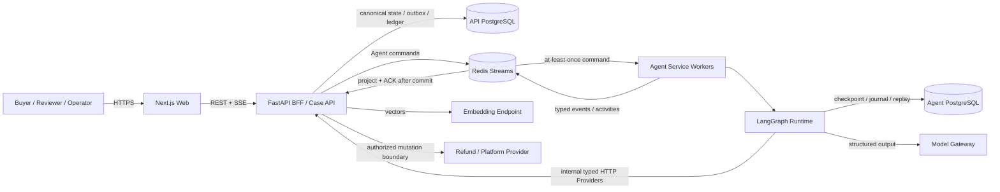

# Return Atlas — Adaptive Return Resolution Agent

Team 27 為電商退貨退款流程設計的 Agent 系統。它將使用者對話、政策檢索、證據評估、獨立審核、人工授權、退回履約與退款執行拆成可追蹤、可恢復、可稽核的工作流。

[線上 Architecture Explorer](https://michael3abc.github.io/2026ShopeeHachathonteam27/) · [Agent 規格](docs/spec/README.md) · [開發進度與驗證證據](docs/progress.md) · [本機執行手冊](scripts/README.md)

> 本 README 是專案入口與整體規格摘要。欄位、狀態與 wire contract 以 [`apps/contracts`](apps/contracts/README.md) 的程式碼及生成 schema 為準；Agent 不變條件以 [`docs/spec`](docs/spec/README.md) 為準；資料庫結構以各服務 migration 為準。

## 1. 專案定位

Return Atlas 解決的不是單一聊天回覆，而是「退款申請如何安全地從自然語言走到可執行結果」：

- 將自由文字申請正規化為 typed intent，並綁定可信訂單與品項。
- 依市場、原因、時間與品項選取版本化 Policy，保存實際採用的 bundle。
- 針對缺少的澄清或證據中斷工作流，待使用者補充後從 checkpoint 恢復。
- 由 Resolver 提案、Verification 驗證、Reviewer 獨立複核；三者責任分離。
- Reviewer 核准後再通過金額與 User Risk 的 deterministic authorization gates。
- 將「允許退款」與「退回商品、驗收、實際退款」分開，避免提前付款。
- 將案件活動、決策來源、人工修正與背景 Memory 生命週期保存為可稽核事件。

### 主要角色

| Actor | 權限與責任 |
| --- | --- |
| Buyer | 建立自己的案件、補充說明／證據、確認 Policy path 與退回要求。 |
| Reviewer | 查看授權 dossier，執行 `APPROVE`、`EDIT` 或 `REJECT`；不同於 LLM `reviewer` node。 |
| Operator | 以受限 Demo 介面模擬可信物流與驗收事件；不能任意指定付款結果。 |
| Agent Service | 消費 command、執行 LangGraph、呼叫 typed Providers 並發布事件。 |
| API / BFF | 擁有 canonical case state、身份／角色、資料持久化、投影、履約與退款邊界。 |

## 2. 能力範圍與完成度

| 能力 | 目前狀態 | 說明 |
| --- | --- | --- |
| 對話 intake、澄清、補件與 resume | 已實作 | LangGraph interrupt/checkpoint；API 以 typed command 恢復。 |
| Policy v1 / v2 | 已實作 | v2 支援猶豫期、到貨損壞、寄錯商品、獨立品項未交付及 path confirmation。 |
| Evidence 與圖片附件 | 已實作 | JPEG／PNG／WebP；`ASSESS`、`PROPOSE_OR_REVISE`、`REVIEW` 可載入實際像素。 |
| Verification、Reviewer 與修訂迴圈 | 已實作 | Reviewer 只輸出 `APPROVE`／`REVISE`；修訂耗盡轉 Human Review。 |
| Monetary / User Risk gates | 已實作 | Reviewer `APPROVE` 後由 deterministic code 決定自動化授權，不改寫 Reviewer verdict。 |
| Human Review | Demo 已實作 | 有角色投影、dossier integrity 與持久化結果；正式企業身份與 approval workflow 待接入。 |
| Return fulfillment | Demo 已實作 | 支援退回確認、到貨、驗收、爭議與逾期，付款僅在完整條件通過後釋放。 |
| Refund application | Deterministic Demo | 有 reservation、ledger、冪等與 UNKNOWN recovery；不是 Shopee 正式金流。 |
| Operational Memory | 已實作 | 結案後非同步 distillation；candidate 必須經外部治理核准才可檢索。 |
| 真實 LLM / Embedding call | 可配置 | 支援 OpenAI-compatible Chat／Responses 與 embedding endpoint；需另備授權 endpoint 與 key。 |
| Shopee Open API read/write | 待整合 | 目前 Order／Evidence 含 versioned fixture Providers，不宣稱正式商家或訂單串接完成。 |
| Architecture Explorer | 已發布 | 靜態網站，內容與案例不需要 Backend；案例明確標示為 Illustrative。 |

本專案不宣稱 production-ready 金流、正式 Shopee Open API 整合、真實客戶資料驗證、模型 latency／token benchmark，或已量測的學習效果。

## 3. 系統架構



### 服務責任

| Component | 擁有 | 不擁有 |
| --- | --- | --- |
| `apps/web` | Browser UI state、表單、案例／Activity 顯示、同源 API proxy | canonical case state、角色判定、Graph resume、退款授權 |
| `apps/api` | Case lifecycle、Demo session、RBAC、API DB、outbox、SSE projection、Policy／Evidence／Verification／Human Review／履約／退款能力 | LangGraph 執行、Agent checkpoint、模型推理 |
| `apps/agent_service` | Redis workers、composition、command journal、checkpoint adapter、Activity／Memory workers | Public browser API、API DB、canonical case state、退款 mutation |
| `packages/agent_runtime` | 18-node LangGraph、typed working state、routing、prompts、模型與 Provider contracts 的使用方式 | Queue、HTTP server、business DB、UI state |
| `apps/contracts` | 跨服務 DTO、enum、validation、JSON Schema、HTTP／Redis adapter contracts | 服務 orchestration 或持久化實作 |
| API PostgreSQL | 案件、事件、政策、證據、授權、履約、退款 ledger、Memory vector index | Graph checkpoint 與 Agent command journal |
| Agent PostgreSQL | LangGraph checkpoint、command journal、Memory replay／completion join | canonical business lifecycle 與付款 ledger |
| Redis | Commands、events、activities、Memory jobs 的 at-least-once transport | 任何 canonical business truth |

### 狀態所有權

以下狀態不可互相替代：

1. **Backend business state**：`CaseStatus` 由 API 擁有並投影給 Web。
2. **Agent execution state**：`AgentState` 只描述 LangGraph 目前工作資料。
3. **Checkpoint / journal state**：由 Agent PostgreSQL 支援 resume、去重與重播。
4. **Frontend UI state**：由 API response／SSE event 映射，不直接訂閱完整 `AgentState`。
5. **Background state**：Activity narration 與 Memory distillation 可在案件 terminal 後繼續。

## 4. 核心案件流程

### 4.1 跨服務路徑

```text
User action
  → Web handler
  → Case API transaction
  → PostgreSQL transactional outbox
  → Redis command
  → Agent Service worker
  → LangGraph + typed HTTP Providers
  → Redis lifecycle / terminal events
  → API transaction + projection
  → REST / SSE
  → Web state update
```

API 不同步呼叫 LangGraph。Command 與 event 均可能重送，因此 command journal、event hash、projection cursor、outbox 與 side-effect key 必須維持冪等。

### 4.2 LangGraph

目前 Graph 的實際 node IDs：

```text
parse_request → request_clarification → load_case_context → retrieve_policy
→ prepare_memory_query → retrieve_memory → assess_case → evaluate_policy
→ confirm_policy_path → request_evidence → propose_decision
→ external_verification → reviewer → record_revision_event
→ await_human_review → emit_resolution_handoff
→ enqueue_memory_distillation → terminate_automation
```

上列是 node inventory，不代表單一路徑。Conditional routes 包含澄清、補件、Policy confirmation、Verification retry、Reviewer revision、Human Review、成功 handoff 與 fail-closed termination。完整 edges、state read/write 與 source references 請使用 [Architecture Explorer](https://michael3abc.github.io/2026ShopeeHachathonteam27/#architecture/exact/parse_request)。

### 4.3 Policy、審核與授權

```text
Policy + Evidence
  → Resolver proposal
  → deterministic Verification
  → independent LLM Reviewer
  → Reviewer APPROVE
  → Monetary Gate + User Risk Gate
  → automatic authorization OR Human Review
```

重要不變條件：

- Reviewer 判斷提案是否有政策與證據支持；不負責決定平台自動化金額或 User Risk 門檻。
- Reviewer `REVISE` 必須附 structured findings；Graph 不能用 gate 結果偽裝成 Reviewer objection。
- Monetary 與 User Risk gates 只在 Reviewer `APPROVE` 後執行，且 API 在付款前重新驗證。
- Human `EDIT` 只能縮限於原申請與原提案允許的品項／金額／政策範圍。
- Policy 不足、Provider 不可用、schema 錯誤或狀態衝突均 fail closed，不切換模型或靜默 fallback。

### 4.4 退回履約與退款

需要退回的核准案件由 API 繼續管理：

```text
AWAITING_RETURN_CONFIRMATION
  → AWAITING_RETURN
  → AWAITING_RETURN_INSPECTION
  → EXECUTING
  → RESOLVED | ESCALATED
```

- `RETURN_ARRIVED` 與 `INSPECTION_PASSED` 必須由受信任 producer、正確 case／authorization／item 與合法順序產生。
- Dispute 或 overdue 進入 `ESCALATED`，不得執行付款。
- Refund mutation 前先建立 item reservation；未知結果保留同一 execution key 與 ownership 復原。
- 只有 refund application `APPLIED` 才代表 Demo 退款成功。Reviewer 核准、Graph `END`、案件 `RESOLVED` 與 Memory 完成是不同生命週期。

### 4.5 Operational Memory

Memory 是結案後的非同步學習候選，不是 Policy，也不影響當案退款完成：

```text
Resolution / correction + durable APPLIED join（v2 FULL_REFUND）
  → MemoryDistillationJob
  → SKIP | CREATE_CANDIDATE
  → CANDIDATE
  → external governance APPROVED
  → future retrieval
```

Reviewer 不讀 Operational Memory。只有 `APPROVED` 且通過 market、reason、category、Policy／registry／path scope 的記憶可被後續案件檢索。

## 5. LLM、Embedding 與圖片邊界

Runtime 定義七種 `ModelTask`：

| Task | 用途 |
| --- | --- |
| `INTAKE` | 將對話正規化為申請意圖。 |
| `ASSESS` | 評估證據與缺口。 |
| `PROPOSE_OR_REVISE` | 產生或修訂處置提案。 |
| `REVIEW` | 獨立審核 proposal。 |
| `MEMORY_QUERY_SUMMARY` | 產生受限的 Memory 查詢摘要。 |
| `MEMORY_DISTILL` | 結案後判斷是否建立學習候選。 |
| `ACTIVITY_NARRATION` | 為可觀察事件產生非阻塞敘述。 |

每次呼叫都要求指定 output schema，回傳後再以 Pydantic 驗證。`ASSESS`、`PROPOSE_OR_REVISE` 與 `REVIEW` 可透過 `EvidenceImageProvider` 載入附件像素；若 endpoint 不支援圖片或 structured output，呼叫明確失敗，不降級成假結果。

`integrated-compass` 預設使用 `compass-5.6-terra`、Responses API、`reasoning_effort=medium`；`integrated-qwen` 保留 OpenAI-compatible Chat profile。模型 retries 固定為 0，不在 customer graph 中自動換 provider。Embedding 是獨立 endpoint，預設 contract 為 `text-embedding-3-large`／1536 dimensions；同維度不代表模型可互換。

## 6. Repository 結構

```text
apps/api/                 FastAPI BFF、canonical case state、capabilities、API migrations
apps/agent_service/       Redis workers、runtime composition、Agent migrations
apps/web/                 Next.js Demo UI、SSE consumers、generated TypeScript contracts
apps/contracts/           Shared DTOs、validators、adapters、JSON Schemas
packages/agent_runtime/   Pure LangGraph workflow、prompts、model adapter
config/                   Reviewer monetary gate 與 User Risk 設定
data/                     Versioned synthetic fixtures（*.json.example）
docs/spec/                Canonical Agent invariants 與詳細規格
docs/reconstruction/      固定歷史快照；不是目前 runtime source of truth
presentation/             Architecture Explorer source、manifest、offline / Pages build
scripts/                  Local launcher、smoke、migration 與驗收工具
tests/                    Cross-service integration tests
```

## 7. 開發環境與 Quick Start

### 7.1 前置需求

- Python `3.12.0`
- [`uv`](https://docs.astral.sh/uv/)
- Node.js `22.23.2` 與 npm
- Docker Engine、Docker Compose v2
- 真模型整合時：授權的 model／embedding endpoint、各自的 client key、internal service token

### 7.2 安裝與 deterministic 驗證

這組命令不要求 live LLM 或正式外部服務：

```bash
uv sync --locked --all-packages
npm --prefix apps/web ci
make check
make check-web
```

`make check` 會執行 Contracts、API、Agent Runtime、Agent Service 與 cross-service tests；`make check-web` 會執行 Web unit tests、lint 與 production build。

### 7.3 啟動整合開發環境

先建立未追蹤設定；不要提交憑證：

```bash
cp .env.example .env
mkdir -p .secrets
chmod 700 .secrets
```

在 `.env` 設定下列檔案路徑與 endpoint：

```dotenv
RETURN_AGENT_MODEL_API_KEY_FILE=.secrets/model_api_key
RETURN_AGENT_EMBEDDING_API_KEY_FILE=.secrets/embedding_api_key
RETURN_AGENT_INTERNAL_SERVICE_TOKEN_FILE=.secrets/internal_service_token
RETURN_AGENT_DEMO_IDENTITIES_FILE=.secrets/demo_identities.json
```

Demo identities 必須保存 `buyer`／`reviewer`／`operator` 的個別 `credential_sha256` 與允許的 Web origin。格式、權限與 Compose host/container path 差異見 [API 認證說明](apps/api/README.md#policy-v2-user-risk-與-demo-認證)；不得在 README、shell history、log 或 Git 中放明文 credential。

以下服務分別在獨立 terminal 執行：

```bash
uv run python scripts/local_import.py check-config
uv run python scripts/local_import.py infra
uv run python scripts/local_import.py migrate
uv run python scripts/local_import.py api
uv run python scripts/local_import.py agent
uv run python scripts/local_import.py web-build
uv run python scripts/local_import.py web
```

預設隔離資源：

| Resource | Port / project |
| --- | --- |
| API PostgreSQL | `58432` |
| Agent PostgreSQL | `58433` |
| Redis | `58379` |
| API | `8200` |
| Agent health | `8290` |
| Web | `3200` |
| Compose project | `team27-policy-v2-user-risk` |

瀏覽器入口為 `http://127.0.0.1:3200`。`web-build` 會將本次 API URL 編入 Next.js rewrite；變更 API port 後必須重建 Web。若同時使用多個 worktree，請為每個 worktree 指定不同 `--project` 與 ports，且不要共用 DB、Redis namespace 或 pending jobs。

`local_import.py check-config` 只驗證必要設定與 key files 存在，不會測試 endpoint、執行 LLM call 或驗收完整案件。完整命令與 migration recovery 請見 [`scripts/README.md`](scripts/README.md)。

### 7.4 Docker Compose

完整設定 model、embedding、internal token 與 Demo identities 後，可使用 Compose：

```dotenv
RETURN_AGENT_API_PROFILE=integrated-demo
RETURN_AGENT_SERVICE_PROFILE=integrated-compass
RETURN_AGENT_INTERNAL_SERVICE_TOKEN_HOST_FILE=.secrets/internal_service_token
RETURN_AGENT_DEMO_IDENTITIES_HOST_FILE=.secrets/demo_identities.json
RETURN_AGENT_DEMO_IDENTITIES_CONTAINER_FILE=/run/secrets/demo_identities
```

Compose 使用 `*_HOST_FILE` 掛載 secret；7.3 的 host-process launcher 使用 `*_FILE`。兩者不可混用。

```bash
docker compose config --quiet
docker compose up --build -d
docker compose ps
```

預設 Compose ports 為 Web `3000`、API `8000`、Agent `8090`、API PostgreSQL `55432`、Agent PostgreSQL `55433`、Redis `56379`，皆只綁定 loopback，可由環境變數覆寫。不要在未配置 `integrated-demo` API 與明確 Agent profile 時將容器健康狀態視為完整功能驗收。

## 8. 測試與驗收

| 目的 | 命令 | 是否呼叫 live model |
| --- | --- | --- |
| Python 全專案 deterministic suite | `make check` | 否 |
| Web tests、lint、build | `make check-web` | 否 |
| Contract 重新生成 | `make contracts && npm --prefix apps/web run contracts` | 否 |
| Cross-service in-process E2E | `make test-e2e` | 否 |
| Agent transport smoke | `uv run --package return-agent-service python scripts/run_agent_smoke.py` | 依 profile |
| 已啟動整合 stack 的 no-UI E2E | `uv run python scripts/run_no_ui_e2e.py --timeout 300` | 是 |
| 已啟動整合 stack 的 browser E2E | `npm --prefix apps/web run test:e2e:live` | 是 |
| Architecture Explorer 內容檢查 | `npm --prefix presentation ci && npm --prefix presentation run check` | 否 |
| Architecture Explorer browser 驗證 | `npm --prefix presentation run test:browser` | 否 |

Live E2E 使用 synthetic order／evidence 與 deterministic refund adapter。成功只證明該 profile 的整合路徑，不代表正式 Shopee 訂單、物流或金流通過。

CI 另外驗證 PostgreSQL migrations、downgrade protection、Redis Activity transport、generated contract drift、Web build、Compose config 與三個 Docker images。詳見 [`.github/workflows/checks.yml`](.github/workflows/checks.yml)。

## 9. 設定、安全與部署不變條件

- `.env`、`.secrets/`、runtime artifacts 與原始客戶資料不得進 Git。
- 公開 browser session 使用 HttpOnly、SameSite cookie；狀態變更須驗證 Origin。
- Agent Service 與 API internal Providers 使用獨立 Bearer service token；瀏覽器不可呼叫 internal routes。
- Model gateway 上游 credential 留在 gateway server；此 repository 只使用被授權的 client key。
- API 與 Agent 使用不同 PostgreSQL database 與 migration lineage，不得互相讀寫。
- 新版程式不得重播不相容的舊 checkpoint、pending command/event 或 Memory job；升級前先排空、隔離或依 runbook 歸檔。
- Policy、gate config、schema 或 model identity 變更必須版本化；不能靜默沿用舊 persisted decision。
- Redis delivery 是 at-least-once；任何付款、review completion 與 projection 都必須依穩定 ID／hash 保持冪等。
- Production profile 設定不完整時必須啟動失敗，不得退回 fake Provider 或 in-memory persistence。

GitHub Pages 只發布 `presentation/dist/`，不發布 repository、設定、secret 或 runtime data。Architecture Explorer 本身不呼叫 Backend、LLM、GitHub API 或 CDN。

## 10. 規格與變更管理

任何跨服務 contract、Graph route、CaseStatus、DB schema、Policy evaluator、authorization gate、Provider 或部署 profile 變更，必須在同一個 logical change 中：

1. 更新 executable contracts 與生成 schema。
2. 更新受影響的 `docs/spec` canonical 文件。
3. 新增或更新 deterministic tests；需要時補 migration／recovery 測試。
4. 更新 Architecture Explorer 的 baseline、entities、scenarios 與 source manifest。
5. 執行 contract drift、Python、Web、Explorer 與必要 live-profile 驗證。
6. 明確記錄「Source verified」「Recorded execution」「Test fixture」「Illustrative」的差異。

`presentation/verify-architecture-sync.py` 會偵測 Graph、API、contracts、DB、Frontend mapping 或 deployment source 在 Explorer baseline 後的變更；若架構內容未同步，CI 必須失敗而不是發布過期網站。

## 11. 已知限制

- `integrated-demo` 的 Order、Evidence 與部分 Logistics 資料來自 versioned fixtures。
- Refund application 是 deterministic Demo adapter，不會執行正式平台金流。
- 真 LLM 與 embedding 需要外部 endpoint；一般 CI 不執行 live calls。
- Human Review 的 Demo role/session 不等於正式企業身份、稽核與 approval system。
- Architecture Explorer 的案例回放是 source-backed Illustrative traces，不是 production execution replay。
- Operational Memory candidate 不會自動核准；目前證據不能宣稱已形成量測完成的自我學習閉環。
- 歷史 reconstruction 文件固定於舊 snapshot，只供追溯，不應拿來覆蓋目前 source 行為。

## 12. 文件索引

| 文件 | 用途 |
| --- | --- |
| [`docs/spec/README.md`](docs/spec/README.md) | Agent scope、名詞、全域不變條件與詳細規格索引 |
| [`docs/spec/01-agent-graph.md`](docs/spec/01-agent-graph.md) | Graph nodes、routing、working state、loop 與 interrupt/resume |
| [`docs/spec/02-agent-contracts.md`](docs/spec/02-agent-contracts.md) | Domain、review、handoff、Memory 與 UI contracts |
| [`docs/spec/04-operational-memory.md`](docs/spec/04-operational-memory.md) | Memory lifecycle、治理、replay 與 migration |
| [`docs/spec/06-agent-acceptance-criteria.md`](docs/spec/06-agent-acceptance-criteria.md) | 驗收條件與 Definition of Done |
| [`docs/spec/08-external-interfaces.md`](docs/spec/08-external-interfaces.md) | Provider、HTTP、Redis、SSE、Activity 與 attachment boundaries |
| [`docs/spec/09-policy-v2-integration.md`](docs/spec/09-policy-v2-integration.md) | Policy v2、User Risk 與 return fulfillment |
| [`docs/progress.md`](docs/progress.md) | 已執行驗證、實跑證據與未完成項目 |
| [`docs/decisions.md`](docs/decisions.md) | 重要產品與技術決策 |
| [`scripts/README.md`](scripts/README.md) | Launcher、smoke、migration 與 recovery runbook |
| [`presentation/README.md`](presentation/README.md) | Architecture Explorer build、驗證、離線版與 Pages 發布 |

## License

本 repository 目前未提供開源授權檔。除非專案擁有者另行授權，請勿假設可重製、散布或商業使用。
