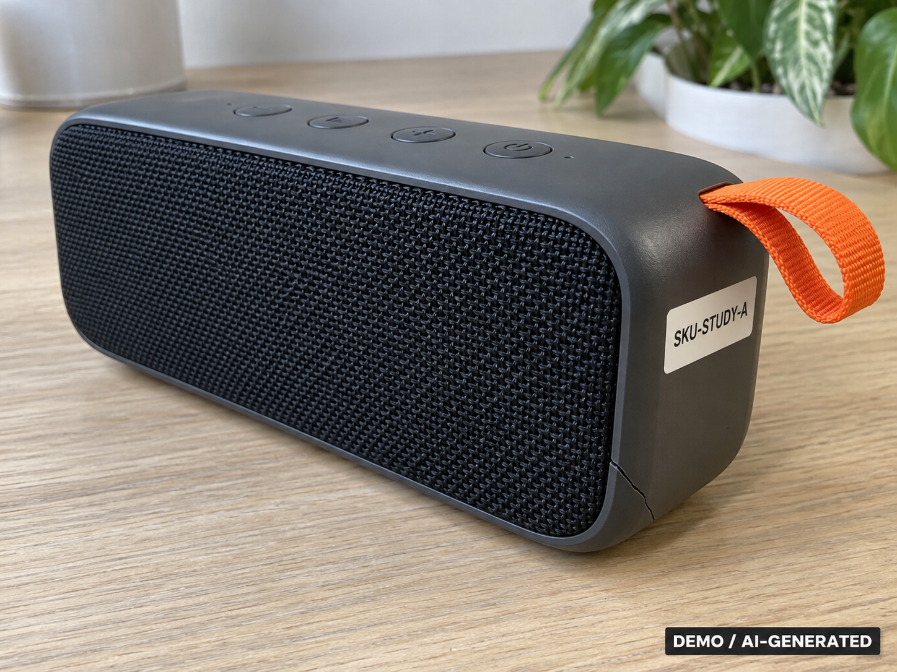
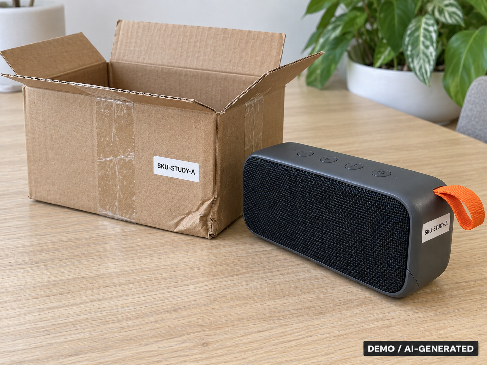
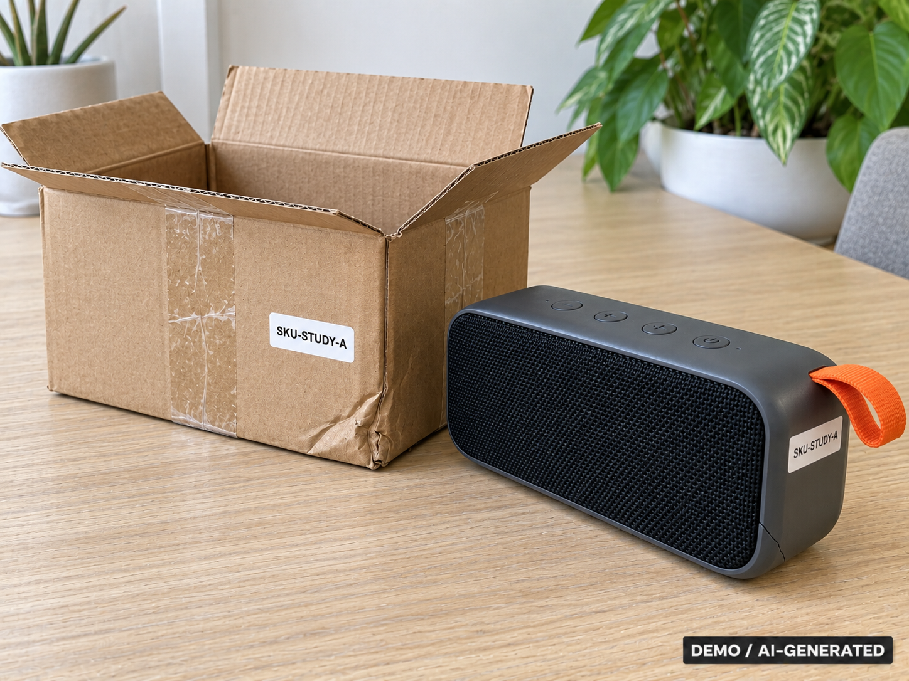
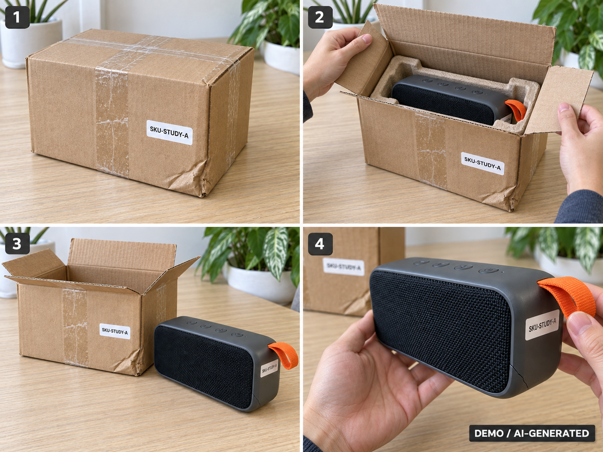

# Demo 買家對話腳本與證據圖

本腳本用於展示「有邊界、可追溯」的退貨 Agent，不是要讓 Agent 猜中
退款答案。所有素材都是合成 Demo 圖；退款與 Memory 都是隔離環境資料。

## 開場（15 秒）

> 今天不是示範一個會聊天的客服機器人。我會先提供不足的證據，讓 Agent
> 明確說明哪個 claim 尚未成立；補齊資料後，它才重新評估、經過獨立
> Reviewer，並保留可追溯的全案回顧。

## A：買家第一次送件

在首頁填寫：

| 欄位 | 值 |
| --- | --- |
| 訂單編號 | `ORDER-DEMO-001` |
| 選擇圖片 | `data/demo-case-study/images/a/closeup.png` |
| 圖片對應品項 | 音箱／申請的商品 |

貼上以下買家訊息：

> 昨天收到石墨灰藍牙音箱，拆箱時發現正面右下外殼有裂痕。我尚未使用，想申請這件商品退款，先附上裂痕近照。

此時對評審說：

> 這張圖只能支持「商品有裂痕」，不能單獨證明裂痕在到貨時就存在。
> 所以正確行為不是直接退款，也不是直接拒絕，而是提出一次具體、可驗證的補件要求。

## B：收到補件要求後

若畫面顯示要求包裝、商品身分與拆箱情境，依序選取下列三張圖：

| 圖片 | 用途 |
| --- | --- |
| `data/demo-case-study/images/a/package.png` | 商品與受損包裝同框 |
| `data/demo-case-study/images/a/identity.png` | 商品／包裝身分對應 |
| `data/demo-case-study/images/a/arrival.png` | 合成四格拆箱情境 |

貼上以下補件訊息：

> 補上同一件石墨灰藍牙音箱與包裝、商品識別貼紙，以及依序排列的拆箱照片。照片中的識別為 SKU-STUDY-A；拆開包裝、取出商品後就看見同一處裂痕，尚未使用。

| 包裝與商品同框 | 商品身分 | 拆箱情境 |
| --- | --- | --- |
|  |  |  |

此時對評審說：

> Agent 會把新資料加入可見 evidence bundle，重新評估原本未成立的 claim。
> 它不能把買家「我沒使用」的文字本身當成已驗證事實，也不能因為補件成功就跳過 Policy、Verification 或 Reviewer。

## C：裁決、Memory 與可信賴性

當 UI 顯示 Reviewer／最終 handoff 時，照這段講：

> 裁決不是由單一 prompt 直接授權：Resolver 提案後，Verification 與獨立
> Reviewer 都要通過；退款執行仍是下游動作，不會被 UI 假稱已完成。
>
> 結案後 Distiller 讀的是完整、去識別化的 learning trace：最初主張、
> 補件要求、實際取得的證據、assessment 變化、提案、審查與最終 handoff。
> 它最多提出一則有 scope、適用限制與禁止推論的候選經驗；只有治理核准後
> 才能進入 Memory 索引。

可指向這三個畫面／欄位：

1. Evidence request：未成立的 claim 與允許的補件類型。
2. Reviewer：`APPROVE` 或 `REVISE` 與具體理由；不是隱性風險分數。
3. Memory／活動紀錄：candidate 的 `source_event_refs`、scope、Policy version 與
   governance 狀態。不存在於本案 trace 的 event ID 會 fail-closed 拒絕入庫。

## 必須誠實說明的邊界

- 這些圖片標示為 `DEMO / AI-GENERATED`；四格拆箱圖不是現實的時間證明。
- Memory 候選不等於已核准經驗，更不會覆蓋 Policy 或直接授權退款。
- 最新 32 案隔離 E2E 驗證了 trace、Distillation、來源驗證與入庫鏈；尚未完成
  A/B/C retrieval 對照，所以不能聲稱 Memory 已被因果證明能提升下一案準確率。
- 現場使用 Terra 時，補件／裁決路徑會隨模型輸出與證據而變；若未出現預期
  evidence request，保留該案例紀錄，不要重跑到看起來成功為止。

