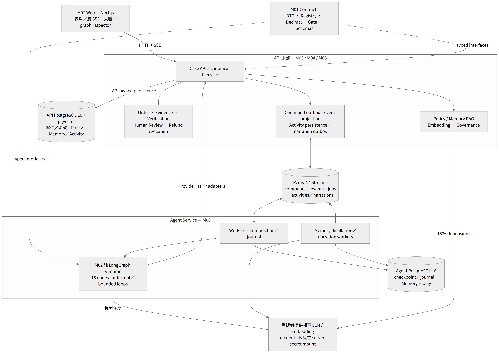
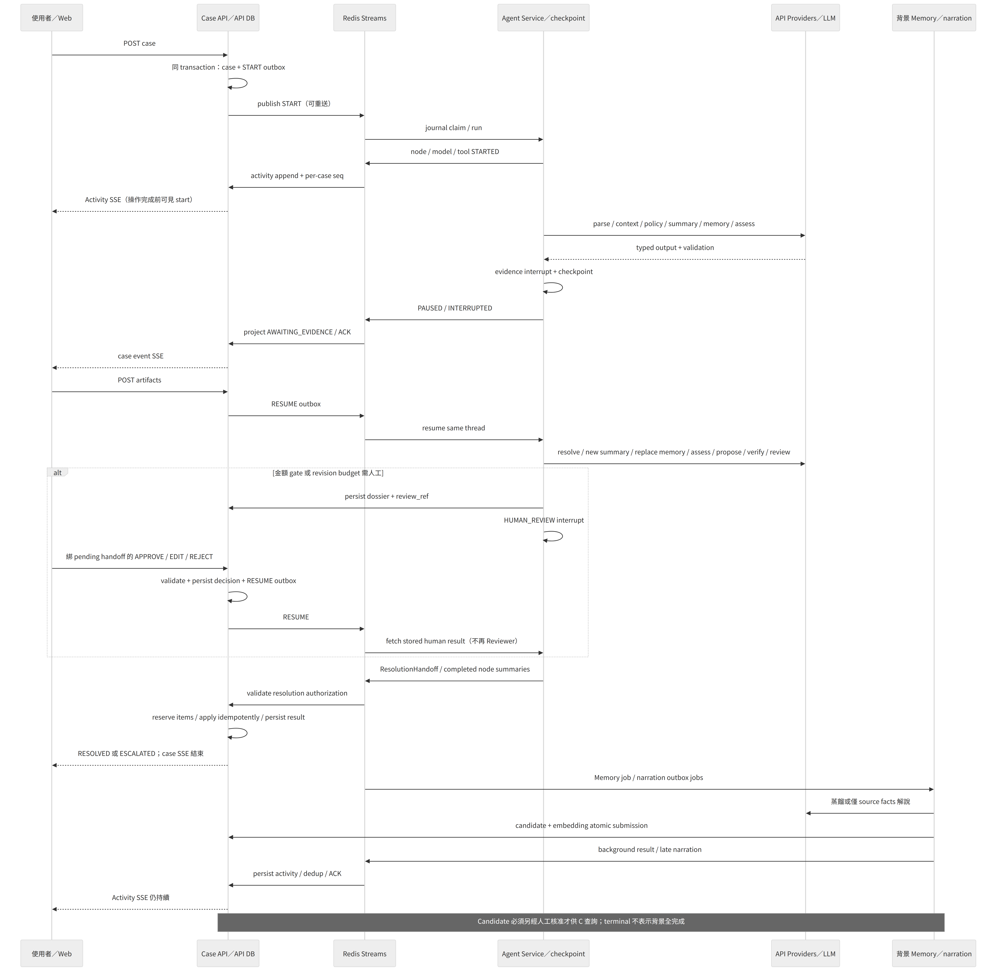

# 總體規格

## 產品行為

內部退貨 Demo：客戶提出退貨主張，Agent 取得可信訂單與適用 Policy，以逐 claim 證據判斷提出 `FULL_REFUND` 或 `DECLINE`。資料不完整時澄清／補件；獨立 Reviewer 複核；退款金額由程式計算與重新授權。核准後可自動退款或暫停等待人工。案件無法安全繼續則終止自動化，不假裝已進入人審。人工修正及 Reviewer 修正可供背景蒸餾成待核准操作經驗。

## 模組依賴與部署

可編輯圖源：[architecture.mmd](diagrams/architecture.mmd)。M01 為各模組唯一共享契約；M02 只依賴 M01 與注入介面；M03/M04/M05 在 API；M06 組合 M02、Provider adapters、Redis 與 Agent DB；M07 僅呼叫 API。

| 元件 | 專屬資料 | 可呼叫／不可呼叫 |
| --- | --- | --- |
| Web | 暫存表單、兩條 SSE cursor、播放位置 | HTTP／SSE → API；不可直接存 DB／resume graph |
| API | canonical case、event transcript、verification、human dossier、退款、Policy／Memory vectors、activity seq／outbox | Provider HTTP、Redis；不可 import runtime 執行 graph |
| Agent Service | command journal、checkpoint、Memory job 首次結果 | composition／workers／transports；不可直接修改 canonical case |
| Runtime | typed graph state、計數器、當輪 snapshots | framework-neutral observer、model／Provider interfaces；不持有 HTTP／Redis／DB |
| Model | 單次 task 的 input | 不持有金額決策權、授權權、資料庫或任意 tool execution 權 |

API DB 與 Agent DB 分離，PostgreSQL 16；API pgvector 1536 維；Redis 7.4 AOF。Web 3000、API 8000、Agent health 8090；服務間 DNS，不使用瀏覽器可見 URL 存 token。數據是合成資料，退款 adapter 是 deterministic mock-money。

## 主流程與背景時序

可編輯圖源：[sequence.mmd](diagrams/sequence.mmd)。完整節點圖：[Agent graph PNG](assets/diagrams/agent-graph.png)／[Mermaid](assets/diagrams/agent-graph.mmd)。

`POST cases → API transaction(case+START outbox) → Redis → journal claim → graph → internal Providers → checkpoint interrupt 或 resolution → service event → API transaction(projection+dedup) → ACK`。退款由 API 執行，非 Reviewer tool；Memory 可在主流程結束後才蒸餾、向 API 提交。Activity 與 narration 使用獨立 channel，可能晚於結案。

## 全域不變條件

- **SYS-R01**：Policy 高於 Memory；Reviewer 不讀 Memory 或 Assessment，獨立檢查完整 evidence bundle。structured rationale 不是 hidden reasoning。
- **SYS-R02**：只有 API 能改 canonical status；Reviewer APPROVE、ResolutionHandoff、退款 SUCCEEDED/APPLIED 是三種不同事實。
- **SYS-R03**：程式管理 scope、Decimal、versions、loop budgets、gate；LLM 不配置門檻、不換匯、不擴張申請品項。
- **SYS-R04**：所有跨服務物件先 schema 驗證，再執行跨物件驗證；event/command/candidate/handoff ID 不等於安全授權。重送相同 ID 改內容必須衝突，不能當相同請求放行。
- **SYS-R05**：業務安全依賴失敗 fail closed；Memory／narration／Activity 的失敗不能改判退款，但必須如實顯示不可用或紀錄不完整。
- **SYS-R06**：terminal case 不代表背景 jobs 完成；case event 與 activity cursor 不可共用；到達順序不冒充 node 執行順序。
- **SYS-R07**：原始訊息／artifact ref 可以在業務專用 DTO，不能因此放進 Activity、narration 或公開 hidden-CoT。demo 無真實認證，不能宣稱 production-ready。

可更換內部程式實作細節，但以上行為、wire schema、交易與 replay 語意必須保留。已知非理想現況獨立記於 [limitations](limitations.md)，不以本包順手修正。
