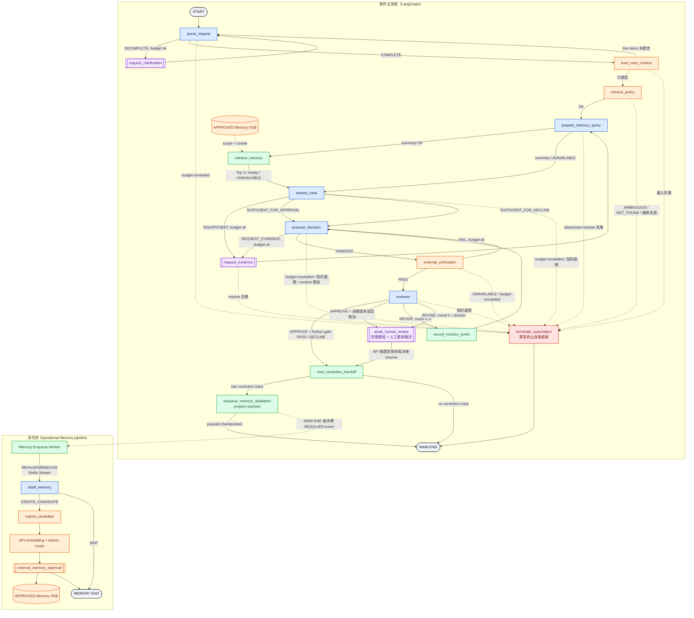

# Agent Graph

## Graph

[高解析度 PNG](01-agent-graph.png) 由下方 Mermaid 原始碼產生；修改流程時須同步重產圖片。此版本使用 `node scripts/render_agent_graph.mjs`（Mermaid CLI 11.16.0）、3× scale、白底、neutral theme 與 Noto Sans CJK TC 字型。



顏色語意：藍色是 LLM structured-output node、綠色是 Agent deterministic node／worker、橘色是 external boundary、紫色是 interrupt、紅色是 fail-closed、灰色是 terminal。主流程中的實線是同步 routing，指向 `terminate_automation` 的虛線是 fail-closed；從 `enqueue_memory_distillation` 到 Memory Enqueue Worker 的虛線是非同步 service 交接，不代表主流程等待。

所有 fail-closed 路徑匯集到 `terminate_automation`，該節點輸出 `ManualEscalationHandoff` 後結束。Graph 只把完整 `MemoryDistillationInput` 寫入同一個 durable checkpoint；Agent Worker 先發布 `RESOLVED`，獨立的 Memory Enqueue Worker 再消費該事件並建立 Redis job。無論 enqueue、distillation、candidate submission 或外部 approval 成敗，都不得改變或阻塞已產生的 `ResolutionHandoff`。

`request_clarification`、`request_evidence` 與 `await_human_review` 是 graph pause point。實作時必須使用 persistent checkpointer 與同一 `thread_id` resume；UI 與 queue 不屬於 Agent 團隊。

部署時 graph 本身位於 `packages/agent_runtime`，由 `apps/agent_service` 的 Redis
worker 呼叫。API 只送出 versioned start/resume command 並消費 event，不 import
runtime。這個 service boundary 不增加或改寫任何 graph node 或 edge。

## Node 定義

| Node | Owner | 類型 | 輸入 | 輸出/責任 |
| --- | --- | --- | --- | --- |
| `parse_request` | Agent | LLM structured output | 最新 UserTurn、既有 intent、`OrderSnapshot` line items | 正規化退貨意圖、綁定 `claimed_line_item_ids`、指出缺少欄位 |
| `request_clarification` | Agent routing / 外部 channel | Interrupt | `ClarificationRequest` | 暫停並接收新的 UserTurn |
| `load_case_context` | External | Tool boundary | `case_ref` | `CaseContextLoadResult`（含 `CaseContext`、`OrderSnapshot`） |
| `retrieve_policy` | External | Policy RAG boundary | normalized intent、case facts | versioned `PolicyBundle` 含 `retrieval_status` |
| `prepare_memory_query` | Agent | Evidence ingestion + LLM summary | 主張、申請品項、訂單事實、當下證據；不讀 Memory | 中性 query_summary 或 UNAVAILABLE |
| `retrieve_memory` | Agent | External vector query | query_summary、deterministic scope、policy/registry version | 最多 3 筆 MemorySearchHit，保留 cosine 順序 |
| `assess_case` | Agent | deterministic evidence ingestion + LLM structured output | facts、policy、evidence、approved memory、claim registry | 先將尚未解析的 `UserTurn.attached_artifact_refs` 透過 `EvidenceProvider.resolve` 加入 `evidence_bundle[]`，再產生 `EvidenceAssessment`；`EvidenceRequest.request_id` 由 graph 覆寫 |
| `request_evidence` | Agent routing / 外部 channel | Interrupt | `EvidenceRequest` | 暫停並接收 evidence references；resume 後 graph deterministic 邏輯呼叫 `EvidenceProvider.resolve` 換成 `EvidenceItem` 並 append 到 `evidence_bundle[]`，例外 fail closed |
| `propose_decision` | Agent + graph | LLM structured output 後接 deterministic 組裝 | assessment、facts、policy、evidence、memory、feedback | `ProposedDecisionDraft` → graph 組裝為 `ProposedDecisionHandoff`；或 `EvidenceRequest`；或 `RevisionConflictReport` |
| `external_verification` | External | Deterministic boundary | 完整 handoff | `VerificationResult` |
| `reviewer` | Agent | 獨立 LLM structured output + deterministic metadata | 完整 handoff、**完整 `PolicyBundle`**、claim registry | `ReviewResult`；`reviewer_prompt_version` 與 `reviewed_at` 由 graph 寫入 |
| `record_revision_event` | Agent | Deterministic | rejected handoff、ReviewResult | append-only `DecisionRevisionEvent`，遞增 `revision_round` |
| `await_human_review` | External | Interrupt boundary | handoff、最後的 `ReviewResult`、dossier 與 gate | `HumanReviewResult` |
| `emit_resolution_handoff` | Agent routing | Deterministic | Reviewer-approved/human result | `ResolutionHandoff`；不執行退款 |
| `enqueue_memory_distillation` | Agent | Deterministic | 完整 correction trace 與 final outcome | 組裝 `MemoryDistillationInput` 並寫入 checkpoint；不直接呼叫模型或外部 store |
| `distill_memory` | Agent | Async LLM structured output | correction trace、final outcome、policy/registry version | `MemoryCandidate` 或 `SKIP` |
| `submit_candidate` | External | Memory store boundary | `MemoryCandidate` | `submission_ref`；同一 `memory_id` 冪等 |
| `external_memory_approval` | External | Governance boundary | candidate submission | 核准為 `APPROVED` 或丟棄；Agent 不決定結果 |
| `terminate_automation` | Agent routing | Deterministic | escalation reason、累積 context | `ManualEscalationHandoff`；所有 fail-closed 路徑的匯集點 |

`propose_decision` 是唯一「LLM 後接 deterministic 加工」的節點：模型產出 `ProposedDecisionDraft`，graph 補上 `amount`、`currency`、`handoff_id` 與 `revision_round` 後組裝成 `ProposedDecisionHandoff`。組裝時若違反任一契約不變條件（例如 over-scoping），視為 contract violation 並 fail closed，不進入 Verification。

## Routing 規則

| Current node | 條件 | Next node |
| --- | --- | --- |
| `parse_request` | `completeness = INCOMPLETE` 且 `clarification_round < 2` | `request_clarification` |
| `parse_request` | `completeness = INCOMPLETE` 且 `clarification_round >= 2` | `terminate_automation`（`CLARIFICATION_BUDGET_EXCEEDED`） |
| `parse_request` | `completeness = COMPLETE` | `load_case_context` |
| `parse_request` | `completeness = COMPLETE` 但 `claimed_line_item_ids` 為空且 `OrderSnapshot` 已載入 | `terminate_automation`（`CONTRACT_VIOLATION`） |
| `load_case_context` | 成功且 `claimed_line_item_ids` 已綁定 | `retrieve_policy` |
| `load_case_context` | 成功但 `claimed_line_item_ids` 未綁定 | `parse_request`（第二輪，line items 此時可見） |
| `load_case_context` | 例外或回傳 `None` | `terminate_automation`（`CONTRACT_VIOLATION`） |
| `retrieve_policy` | `retrieval_status = OK` | `prepare_memory_query` |
| `prepare_memory_query` | 摘要成功 | `retrieve_memory` |
| `prepare_memory_query` | 摘要失敗 | `assess_case`，Memory 清空並記 UNAVAILABLE |
| `retrieve_policy` | `retrieval_status = AMBIGUOUS` | `terminate_automation`（`POLICY_AMBIGUOUS`） |
| `retrieve_policy` | `retrieval_status = NOT_FOUND` | `terminate_automation`（`POLICY_NOT_FOUND`） |
| `retrieve_policy` | 有條款的 `effective_from`/`effective_to` 不涵蓋 `case_opened_at` | `terminate_automation`（`CONTRACT_VIOLATION`） |
| `retrieve_memory` | 完成（含查無結果） | `assess_case` |
| `assess_case` | 初始／澄清訊息的 artifact resolve 失敗、reference 不一致，或 evidence subject 不屬於 `ORDER`／claimed items | `terminate_automation`（`CONTRACT_VIOLATION`） |
| `assess_case` | `evidence_status = INSUFFICIENT` 且 `evidence_round < 2` | `request_evidence` |
| `assess_case` | `evidence_status = INSUFFICIENT` 且 `evidence_round >= 2` | `terminate_automation`（`EVIDENCE_BUDGET_EXCEEDED`） |
| `assess_case` | `evidence_status = SUFFICIENT_FOR_APPROVAL` | `propose_decision` |
| `assess_case` | `evidence_status = SUFFICIENT_FOR_DECLINE` | `propose_decision` |
| `assess_case` | `claim_findings` 的 `(claim_id, subject)` pair 集合與期望 pair 集合不符，或 `evidence_status` 與 findings 不一致 | `terminate_automation`（`CONTRACT_VIOLATION`） |
| `request_evidence` | resume 後 resolve 成功 | `prepare_memory_query` |
| `request_evidence` | resume 後 `EvidenceProvider.resolve` 例外 | `terminate_automation`（`CONTRACT_VIOLATION`） |
| `propose_decision` | output 為 `EvidenceRequest` 且 `evidence_round < 2` | `request_evidence` |
| `propose_decision` | output 為 `EvidenceRequest` 且 `evidence_round >= 2` | `terminate_automation`（`EVIDENCE_BUDGET_EXCEEDED`） |
| `propose_decision` | 組裝出合法 `ProposedDecisionHandoff` | `external_verification` |
| `propose_decision` | output 為 `CONFLICTING_REVISIONS` | `terminate_automation`（`CONFLICTING_REVISIONS`） |
| `propose_decision` | 組裝違反契約不變條件 | `terminate_automation`（`CONTRACT_VIOLATION`） |
| `propose_decision` | `propose_round > 6` | `terminate_automation`（`PROPOSE_BUDGET_EXCEEDED`） |
| `external_verification` | `status = PASS` | `reviewer` |
| `external_verification` | `status = FAIL` 且 `verification_round < 2` | `propose_decision`，傳入 `verification_issues` |
| `external_verification` | `status = FAIL` 且 `verification_round >= 2` | `terminate_automation`（`VERIFICATION_BUDGET_EXCEEDED`） |
| `external_verification` | `status = UNAVAILABLE` | `terminate_automation`（`VERIFICATION_UNAVAILABLE`），fail closed |
| `reviewer` | `verdict = APPROVE` 且金額 gate PASS / DECLINE 不適用 | `emit_resolution_handoff` |
| `reviewer` | `verdict = APPROVE` 且金額 gate HUMAN_REQUIRED | `await_human_review`（不消耗 revision budget） |
| `reviewer` | `verdict = REVISE` 且 `revision_round < 3` | `record_revision_event`，再到 `propose_decision` |
| `reviewer` | `verdict = REVISE` 且 `revision_round >= 3` | `await_human_review`（程式產生 `routing_reason = REVISION_BUDGET_EXCEEDED`） |
| `await_human_review` | resume 後 | `emit_resolution_handoff` |
| `emit_resolution_handoff` | `revision_events` 非空或 human `decision ∈ {EDIT, REJECT}` | `enqueue_memory_distillation` |
| `emit_resolution_handoff` | 無 correction trace | `END` |
| `enqueue_memory_distillation` | `MemoryDistillationInput` 已寫入 checkpoint | 主案件 `END`；其後由 Memory Enqueue Worker 消費 durable `RESOLVED` event 並發布 job |
| `distill_memory` | `CREATE_CANDIDATE` | `submit_candidate` |
| `distill_memory` | `SKIP` | Memory pipeline `END` |
| `submit_candidate` | 接受 candidate | `external_memory_approval` |
| `external_memory_approval` | `APPROVED` 或丟棄 | Memory pipeline `END` |
| `terminate_automation` | 完成 | `END` |

Reviewer 不判斷下一個節點。即使原因是 evidence 不足，也只輸出 `REVISE` 與原因；`propose_decision` 再判斷能否用現有資料修正，或產生 `EvidenceRequest`。

`parse_request` 可能執行兩輪，這是必要的：第一輪只有對話內容，尚不知道訂單有幾個品項；`claimed_line_item_ids` 必須在 `OrderSnapshot` 載入後才能綁定。第二輪的行為是單商品訂單**自動綁定且不得詢問**，多商品訂單先嘗試以對話內容比對品項，比對不到或有歧義時才以 `missing_fields` 觸發澄清。`load_case_context` 是唯讀且冪等的，重入無副作用。此迴圈由 `clarification_round` 收斂。

`emit_resolution_handoff` 到 memory 的邊是 conditional：純 `APPROVE` 且無任何 revision 的案件沒有 correction 可蒸餾，直接結束。`enqueue_memory_distillation` 只準備並 checkpoint payload；案件結束後，獨立 Memory Enqueue Worker 由 durable `RESOLVED` event fan-out 到 memory job stream，Memory Worker 才執行 `distill_memory` 與 `submit_candidate`。這些步驟不沿用主案件的同步 routing，也不延後主案件 `END`。詳見 [Operational Memory](04-operational-memory.md)。

## Working state

```text
thread_id
case_ref
conversation_turns[]
normalized_intent
claimed_line_item_ids[]
case_context_ref
order_snapshot_ref
policy_bundle
claim_registry_version
operational_memory[]
memory_retrieval_status
memory_query_summary
memory_retrieval
evidence_bundle[]
evidence_assessment
current_handoff
proposal_history[]
pending_review_result
verification_feedback[]
review_history[]
revision_events[]
memory_distillation_input
clarification_round
evidence_round
verification_round
revision_round
propose_round
prompt_versions
```

這些欄位是 Agent working state，不得成為 backend case status 的副本。外部 snapshot 應帶版本或時間戳；大型 artifact 只保存 reference。

`memory_retrieval_status` 為 `OK | UNAVAILABLE`：`prepare_memory_query` 摘要失敗或 `retrieve_memory` 在 `query_approved` 例外時寫 `UNAVAILABLE`（空結果仍為 `OK`），僅供稽核，不影響 routing。

`pending_review_result` 是必要欄位：Resolver 在收到 `REVISE` 後可能輸出 `EvidenceRequest`，此時流程會離開 `propose_decision` 並經過 interrupt。resume 後必須把原始 `ReviewResult` 重新餵回 `propose_decision`，否則 revision reasons 會遺失，Reviewer 會再次以相同理由 `REVISE`，直接燒完 budget。`pending_review_result` 在成功產生新 handoff 後清除。

## Loop budget 與終止

Counter 一律由 graph 遞增，**模型不得填寫或修改任何 counter**。遞增時點：

| Counter | 遞增時點 | 上限 |
| --- | --- | --- |
| `clarification_round` | 進入 `request_clarification` 時 | 2 |
| `evidence_round` | 進入 `request_evidence` 時 | 2 |
| `verification_round` | `FAIL` 路由回 `propose_decision` 時 | 2 |
| `revision_round` | `record_revision_event` 中 | 3 |
| `propose_round` | 每次進入 `propose_decision` 時 | 6 |

Budget 檢查在 conditional edge 中執行，先檢查再遞增。

`propose_round` 是全域 backstop，防止 `verification_round` 與 `revision_round` 交錯造成的病態迴圈（最壞合法路徑為 1 次初始提案 + 2 次 verification 重試 + 3 次 revision 重試 = 6）。Reviewer 最多修正三次；第四次審核仍為 REVISE 時進入可 resume 的人工審核 UI。其餘 counter 超限仍進 terminate_automation。APPROVE 在任何輪次都先檢查 Python 金額 gate；高額與未設定幣別直接等待人工授權，不再修正。

其他 fail-closed 條件：外部 Verification `UNAVAILABLE`、`retrieval_status` 非 `OK`、`EvidenceProvider.resolve` 例外、handoff 組裝違反契約不變條件、多個 revision reason 的 `required_change` 互相衝突且正式 Policy 無法解決、state contract 損壞。

同一 node 的 routing 只使用 conditional edges 或 `Command` 其中一種，不同時配置 static 與 dynamic outgoing edges。上表中每個具有多個條件的節點都必須以單一 conditional edge 函式實作。

## Interrupt/resume 不變條件

- Interrupt payload 必須可 JSON serialization，且不得包含 evidence bytes。
- Resume 必須沿用原 `thread_id`，新的案件必須使用新的 `thread_id`。
- Node 在 interrupt 之前不得執行不可重入 side effect。
- Resume 後要合併新的 UserTurn/EvidenceItem，再重新執行對應的 parse 或 assess node。初始或澄清 `UserTurn` 已帶的 artifact refs，會在 context 與 claimed items 確定後、首次 assessment 前解析；不要求使用者重傳。新增的 `EvidenceItem` 必須帶 `subject`：一般訊息附件只能屬於 `ORDER` 或 claimed item，補件附件則須符合 `EvidenceRequest.missing_claims[].subject`。
- `pending_review_result` 必須跨 interrupt 存活。
- 每次外部輸入都留下時間戳與來源，但 canonical audit storage 由 backend/integration owner 決定。

圖中兩個 APPROVED Memory VDB 圖示是同一個 PostgreSQL logical store：主流程顯示讀取端，非同步 pipeline 顯示寫入／核准端，非新增服務。

Activity tracing 是旁路 observer，不增加 graph node／edge，也不改這張流程圖的 routing。
每次 node attempt 有獨立 operation/attempt ID；只有正常返回才產生 node_summary。interrupt 是 PAUSED，恢復時建立新 attempt，不能補造先前 attempt 的完成事件。
同步 Provider／model 在呼叫前後記錄 lifecycle；LangGraph custom stream 在 node 執行中即傳遞給 Agent Service。
Runtime 不引入 Redis／HTTP／DB；API 退款執行與結案後 Memory worker 使用同一觀察契約。
非同步 narration 不在 graph state 中、不觸發 Reviewer／退款、不作因果順序依據。詳見 [Activity 契約](02-agent-contracts.md#activity-wire-contract)。
